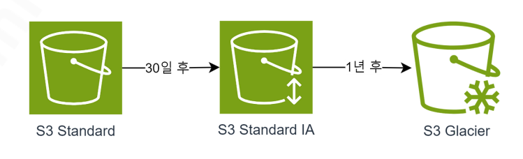

# [AWS] S3 버전 관리, 객체 잠금, 수명 주기 정책

## S3 버전 관리 (Versioning)
S3에 같은 이름의 파일을 중복해서 업로드하면, 아무런 알림 없이 파일을 덮어써버린다. -> 기존 파일 삭제
따라서 같은 이름의 파일을 업로드하더라도 기존 파일이 삭제되지 않게 만드려면 ‘버전 관리’ 기능을 활성화시켜야 한다.
S3 버전 관리 기능은 파일을 덮어쓰더라도 이전 버전의 파일까지 보존하는 기능을 의미

## S3 객체 잠금 (Object Lock)
S3 객체 잠금 기능은 일정 기간 동안 파일의 수정/삭제를 차단하는 기능이다.
S3 객체 잠금 기능은 혹시나 실수로 파일을 수정/삭제하는 걸 방지하기 위해서 사용

### 1. 거버넌스 모드 (Governance Mode)
특별 권한이 있는 관리자만 수정/삭제 가능 (다른 사용자는 수정/삭제 불가)

### 2. 규정 준수 모드 (Compliance Mode)
모든 사용자 수정/삭제 불가능 (루트 사용자 조차도 수정/삭제 불가)

### 법적 보존 (Legal Hold)
기간에 상관없이 수동으로 해제하기 전까지 객체의 수정/삭제를 금지하는 기능이다.
이 기능은 언제 끝날지 모르는 소송과 같은 이슈가 발생했을 때 사용
- 두 모드(거버넌스, 규정 준수)는 보존 기간을 따로 설정해두는데, 법적 보존은 따로 해제하기 전까지 영구적으로 수정/삭제를 금지하는 기능

## S3 수명 주기 정책 (Lifecycle)
S3 수명 주기 정책은 파일을 N일 후에 자동으로 이동/삭제시키는 기능이다.
만약 데이터의 접근 빈도를 예측할 수 있어서 다른 유형의 S3로 이동하고 싶을 때나,
보관 기간이 정해져있어 보관 기간이 지나자마자 파일을 삭제하고 싶을 때 주로 사용
